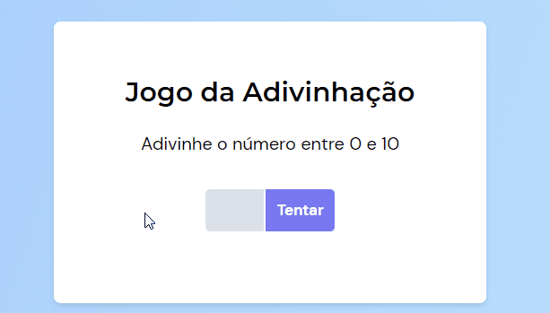

# Number-Guessing-Game

<!-- PROJECT LOGO -->
 

  

  <h3 align="center">Number-Guessing-Game</h3>
  
Made by celinxt

  

    <a href="#about-the-project">About The Project</a>
    -
    <a href="#built-with">Built With</a>
    -
    <a href="#license">License</a>
    -
    <a href="#contact">Contact</a>
  

<!-- ABOUT THE PROJECT -->
## About The Project

 A guessing game where the user tries to match the drawn number. 

  
Project Link - https://celinxt.github.io/Number-Guessing-Game/

(<a href="#readme-top">back to top</a>)

<!-- BUILT WITH -->
## Built With

  
  
  

(<a href="#readme-top">back to top</a>)

<!-- LICENSE -->
## License

Distributed under the MIT License. See `LICENSE` for more information.

(<a href="#readme-top">back to top</a>)

<!-- CONTACT -->
## Contact

E-mail - rudeusmodev@gmail.com

(<a href="#readme-top">back to top</a>)

