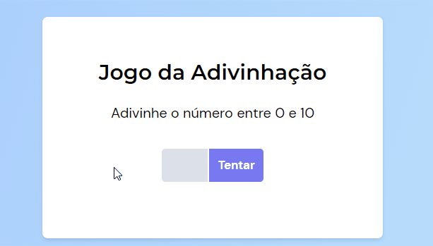

# Explorer-Projeto-11
Um jogo de adivinhação onde o usuário tenta acertar o número sorteado.

Foi utilizado:
<ul>
<li>HTML</li>
<li>CSS</li>
<li>Manipulação de DOM com JavaScript</li>
<li>Funções Callback</li>
<li>Eventos</li>
</ul>

## Vídeo do projeto

  

